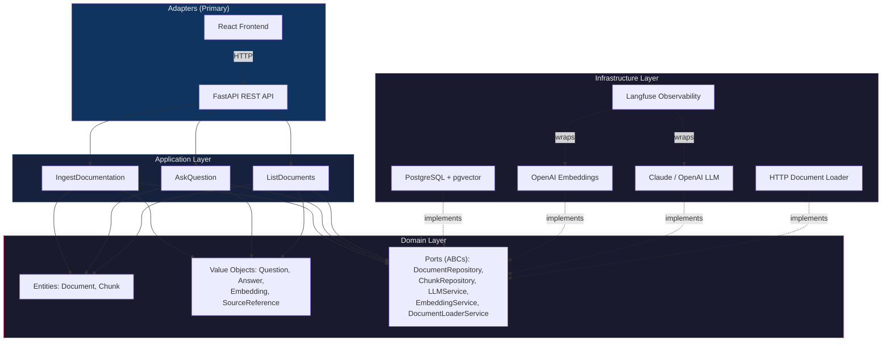
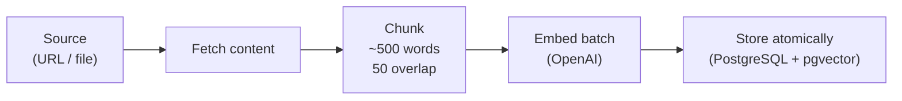
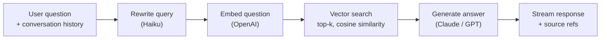

# DocuMentor

A **RAG-powered study assistant** that lets you ingest any public technical documentation and ask questions about it in natural language. It retrieves the most relevant passages via vector similarity search and generates grounded answers with source references — so every claim is traceable back to the original docs.

**Stack:** Python 3.13+ · FastAPI · PostgreSQL + pgvector · Claude / OpenAI · React · uv


<sub>Latencies measured via Langfuse traces on real conversational sessions.</sub>

---

## Why This Project

Most AI chat tools hallucinate freely. DocuMentor is designed around **verifiability**: every answer cites the exact documentation chunks it was derived from, with relevance scores. It supports multi-turn conversations with automatic query rewriting, streams answers token-by-token, and the entire backend is built on a clean hexagonal architecture that makes swapping LLM providers a one-line config change.

### Key Features

- **Document ingestion** — Point it at a URL or upload a file; the system fetches, chunks, embeds, and stores it atomically
- **Conversational RAG** — Multi-turn conversations with LLM-based query rewriting for context-aware retrieval
- **Streaming answers** — Token-by-token NDJSON streaming to the frontend for real-time UX
- **Source attribution** — Every answer includes the retrieved chunks, document titles, and cosine similarity scores
- **Provider-agnostic** — Swap between OpenAI and Anthropic Claude with a single env var (`LLM_PROVIDER`)
- **Opt-in observability** — Langfuse tracing for LLM calls, embeddings, and query rewrites (zero overhead when disabled)

---

## Architecture

The project follows **Hexagonal Architecture (Ports & Adapters)** combined with **DDD tactical patterns**. The domain layer has zero external dependencies — every integration point is defined as an abstract port and implemented in the infrastructure layer.



### Dependency Rules

```
Adapters  ──→  Application  ──→  Domain  ←──  Infrastructure
```

| Layer | Can import from | Never imports from |
|-------|----------------|--------------------|
| `domain/` | nothing | everything else |
| `application/` | `domain/` | `infrastructure/`, `adapters/` |
| `infrastructure/` | `domain/` | `application/`, `adapters/` |
| `adapters/` | `application/`, `domain/` | `infrastructure/`* |

\* The single exception is `dependencies.py`, which wires infrastructure implementations to domain ports via dependency injection.

---

## RAG Pipeline

### Ingestion (`POST /ingest`)



Duplicate detection is built in — sources can be rejected, skipped, or replaced on re-ingestion.

### Query (`POST /ask/stream`)



### Query Rewriting for Conversational RAG

In multi-turn conversations, follow-up questions are often ambiguous on their own — "And what about Caminito del Rey?" or "Can you name a few persons involved on that project?" make no sense without prior context. Embedding these raw questions would retrieve irrelevant chunks.

Before searching, a lightweight LLM rewrites the user's question into a standalone query using the conversation history:

| User says | Rewritten query |
|-----------|----------------|
| "And what about Caminito del Rey?" | "Information about Caminito del Rey." |
| "Can you name a few persons involved on that project?" | "List of key individuals involved in the Caminito del Rey project." |

The rewritten query captures the full intent, producing significantly better retrieval results. This step runs on a fast, cheap model to keep latency low (~1.3s), and falls back to the original question if rewriting fails.

---

## Technical Decisions

| Decision | Choice | Why |
|----------|--------|-----|
| **Vector store** | pgvector (PostgreSQL extension) | Single datastore for relational + vector data. No need to operate a separate Pinecone/Qdrant/Chroma cluster. Cosine distance is native and indexed. |
| **Architecture** | Hexagonal + DDD | Use cases are testable with mocked ports, zero coupling to providers. LLM provider is swappable via config, not code changes. Domain logic has no external dependencies. |
| **Chunking** | Fixed ~500-word windows with 50-word overlap | Deterministic and simple. Overlap prevents context loss at boundaries. Semantic splitting adds complexity without proven retrieval gains at this scale. |
| **Embedding model** | OpenAI `text-embedding-3-small` (1536d) | Best cost/quality ratio for document retrieval. Configurable via env var if a different model is needed. |
| **Query rewriting** | Lightweight LLM for conversational context | In multi-turn conversations, the user's question may be ambiguous ("what about performance?"). Rewriting into a standalone query dramatically improves retrieval. Runs on a cheap, fast model to minimize latency. |
| **Streaming** | NDJSON over HTTP | Simpler than WebSockets for unidirectional streaming. No connection upgrade overhead. Works with standard HTTP clients and proxies. |
| **Observability** | Langfuse via wrapper pattern | Decorators wrap LLM/embedding services without touching domain or application layers. Zero overhead when `LANGFUSE_ENABLED=false`. |
| **Transaction model** | Unit of Work | Repositories use `flush()`, not `commit()`. The UoW controls transaction boundaries, ensuring document + chunks are stored atomically or rolled back together. |
| **Testing strategy** | 3-tier (unit / integration / e2e) | Domain tests use zero mocks. Use case tests mock all ports. Integration tests run against real PostgreSQL via testcontainers. |

---

## Observability

DocuMentor integrates [Langfuse](https://langfuse.com) for LLM observability, enabled via `LANGFUSE_ENABLED=true`. Every LLM and embedding call is traced without modifying domain or application code — the infrastructure layer uses a **wrapper pattern** that decorates services at dependency injection time.

### What's Traced

| Trace | What it captures | Avg latency |
|-------|-----------------|-------------|
| `llm-generate-stream` | Question, conversation history, context chunks, streamed output | ~2.3s |
| `llm-rewrite-query` | Original question, conversation history, rewritten standalone query | ~1.3s |
| `embedding-embed` | Input text, embedding dimensions (1536d) | ~400ms |

Each trace includes full input/output payloads, making it possible to debug retrieval quality, inspect which chunks the LLM actually received, and see how query rewriting transforms ambiguous follow-ups into effective search queries.

When `LANGFUSE_ENABLED=false` (the default), the wrappers are not applied and there is zero performance overhead.

---

## Project Structure

```
src/documentor/
├── domain/                 # Entities, Value Objects, port interfaces (ABCs)
│   ├── models/             # Document, Chunk, Question, Answer, Embedding
│   ├── repositories/       # DocumentRepository, ChunkRepository
│   ├── services/           # LLMService, EmbeddingService, DocumentLoaderService
│   └── unit_of_work.py     # UnitOfWork port
├── application/            # Use cases + DTOs
│   └── use_cases/          # IngestDocumentation, AskQuestion, ListDocuments
├── infrastructure/         # Concrete implementations
│   ├── persistence/        # PostgreSQL repos, ORM models, UoW
│   ├── external/           # Anthropic, OpenAI, HTTP loader
│   └── observability.py    # Langfuse wrappers
└── adapters/
    └── api/                # FastAPI app, routes, schemas, DI, error handlers

frontend/                   # React + TypeScript + Tailwind CSS
├── src/pages/              # Ask, Documents, Ingest pages
├── src/hooks/              # Custom hooks (streaming, data fetching)
└── src/components/         # UI components (chat, sources, forms)

tests/
├── unit/                   # Domain + application tests (fast, no infra)
├── integration/            # PostgreSQL via testcontainers
└── e2e/                    # Full API tests with httpx
```

---

## Getting Started

### Prerequisites

- [Python 3.13+](https://www.python.org/)
- [uv](https://docs.astral.sh/uv/) — Python package manager
- [Docker](https://www.docker.com/) — for PostgreSQL + pgvector
- [Node.js 20+](https://nodejs.org/) + [pnpm](https://pnpm.io/) — for the frontend

### Quick Start

```bash
# 1. Install dependencies
uv sync

# 2. Set up environment
cp .env.example .env
# Edit .env with your API keys (OPENAI_API_KEY, ANTHROPIC_API_KEY)

# 3. Start the database
make up

# 4. Run migrations
make migrate

# 5. Start the backend
make dev
# → http://localhost:8000

# 6. Start the frontend (separate terminal)
cd frontend && pnpm install && pnpm dev
# → http://localhost:5173
```

### API Endpoints

| Method | Route           | Description                              |
|--------|-----------------|------------------------------------------|
| GET    | `/health`       | Health check                             |
| POST   | `/ingest`       | Ingest documentation from URL or file    |
| GET    | `/documents`    | List ingested documents                  |
| POST   | `/ask`          | Ask a question (full response)           |
| POST   | `/ask/stream`   | Ask a question (streaming NDJSON)        |

Interactive API docs available at `/docs` (Swagger) and `/redoc` when the server is running.

---

## Development

### Available Commands

| Command          | Description                                  |
|------------------|----------------------------------------------|
| `make dev`       | Start backend with hot reload                |
| `make up`        | Start PostgreSQL container                   |
| `make down`      | Stop PostgreSQL container                    |
| `make migrate`   | Run Alembic migrations                       |
| `make reset-db`  | Drop, recreate, and migrate from scratch     |
| `make lint`      | Lint with ruff                               |
| `make format`    | Format with ruff                             |
| `make test`      | Run unit tests                               |
| `make test-int`  | Run integration tests (requires Docker)      |
| `make test-all`  | Run all tests with coverage report           |

### Testing

```bash
make test          # Unit tests — fast, no external dependencies
make test-int      # Integration tests — real PostgreSQL via testcontainers
make test-all      # Full suite with coverage report
```

---

## Documentation

Detailed documentation is available in [`docs/`](docs/):

- [Architecture Overview](docs/architecture.md)
- [RAG Pipeline Flows](docs/flows.md)
- [API Reference](docs/api-reference.md)
- Architecture Decision Records:
  - [001 — Dependencies](docs/decisions/001-dependencies.md)
  - [002 — Hexagonal Architecture](docs/decisions/002-hexagonal-architecture.md)
  - [003 — RAG Strategy](docs/decisions/003-rag-strategy.md)
  - [004 — LLM Provider Abstraction](docs/decisions/004-llm-provider-abstraction.md)
